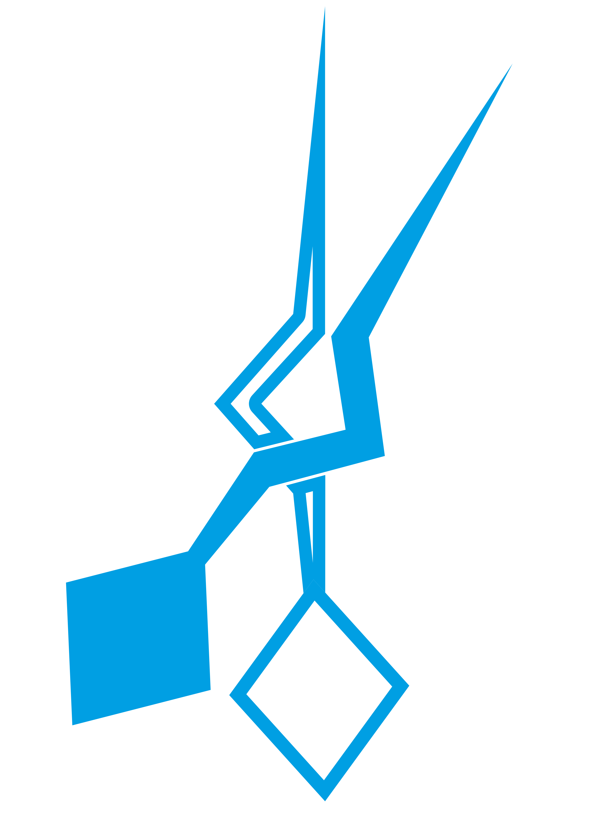

<p align="center">
  
</p>

<h1 align="center">The Snips Controllers</h1>

<p align="center">
  Wireless handheld controllers for R2-D2 droid operation, built to work with the
  <a href="https://github.com/thePunderWoman/Amidala">Amidala</a> control system and firmware.
</p>

<p align="center">
  <a href="https://github.com/thePunderWoman/SnipsControllers/actions/workflows/ci.yml">
    
  </a>
</p>

## Status

**Awaiting prototype PCBs.**

Schematics, part matching, and layout review are complete; boards are in the ordering/fab pipeline. See [PCB/README.md](PCB/README.md) for the full hardware writeup and [PCB/design-review-2026-08-23.md](PCB/design-review-2026-08-23.md)
for the latest design review. PCBs will likely arrive middle to late September. Once the controllers have been validated, we'll start ordering larger runs and make them available for people to buy.

## What they are

The Snips controllers are dual small handheld controllers for driving your droid
builds. These controllers are intended to be small, but powerful controllers that
can be configured via Amidala to do whatever you prefer to do.

## What they offer

Each Snips controller offers 6 face buttons, 2 side buttons on each side, 1 bumper
button, and a precision hall effect analog trigger. They utilize standard thumbsticks
and are specifically designed to work with either gulikit hall effect or tmr kits,
making sure you have no stick drift over time.

Combining all buttons, including center stick, that's 13 button options per controller. Plus, through Amidala each button can support regular press, alt button press, double press, and long press. All told, you have currently up to **52** different programmable options per controller!

Each controller also has a small OLED screen just above the thumbsticks for as much
info as you'd like to see, like power levels, which hand the controller is for, which
droid, volume levels, etc.

## Communication

These controllers are designed to work with Xbee3 modules for long distance secure
communication, but also, since they are powered by ESP32-S3-WROOM-1 modules, they also
support bluetooth and ESP-Now for connectivity. They will be able to swap between droids, as well.

## Batteries

We're still working on the exact battery spec, but they will either be swappable single 18650 or dual 14500 lithium ion modules. The controllers have a built in charging circuit. So you can charge them via USB-C, or just plain swap mid-event if they run out.

## Case

The controller case, aka how it looks and feels in the hand is still to be designed, but will be open source, allowing you to make it as unique to your build as you'd like.

## Estimated price

This is yet to be determined since we're so early in the prototype stage, but the pricing will be fully transparent. We will likely try to bundle two controllers with an Amidala board, and hopefully close to at cost with a small donation to charity included.

## Repository layout

| Path | Contents |
|---|---|
| [`src/`](src) | ESP32-S3 firmware (PlatformIO) |
| [`test/`](test) | Native unit tests (no hardware required) |
| [`PCB/`](PCB) | KiCad schematics, layout, GPIO reference, and design notes |
| [`scripts/`](scripts) | BOM/part-matching tooling |

## Development

Requires [PlatformIO](https://platformio.org/) (CLI or IDE extension).

```bash
# Build the firmware
pio run

# Run unit tests (no hardware required)
pio test -e native
```

See [CONTRIBUTING.md](CONTRIBUTING.md) for the full contribution workflow.
